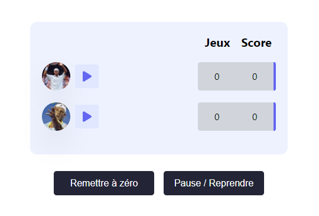

Tennis Score :
==============

The project is a practical application of the OpenClassRoom course `Use the Redux state manager to manage the state of your applications`.

### Apercu :

### Practiced tools :
### `Redux` `React-redux` `Immer`

### Settings :
1. Install dependencies : `yarn install or yarn`
2. Run project : `yarn start`

